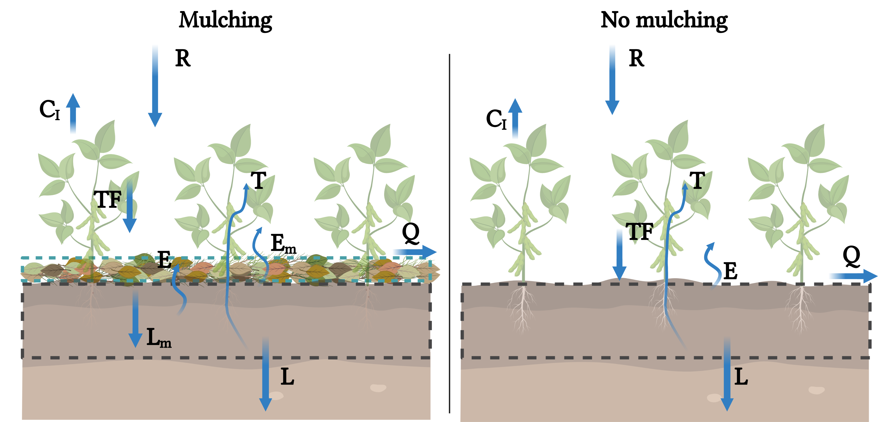

# SoilMulch.jl

Documentation for SoilMulch.jl

# Model description

The **SoilMulch** is a model that simulates the coupled water balance and crop growth
under no mulching and mulching managements.



When a mulching layer is added, the model computes the water balance considering
two layers, whereas the mulching layer is treated similarly as coarse soil.

Under mulching conditions, the water balance is the difference between the
inputs and outputs of water into the mulching and soil layers, respectively as:

$$\phi Z_m \frac{d\vartheta}{dt} = R(t) - C_I(R,C) - Q(\vartheta, R) - L_m(\vartheta) - E_m(\vartheta)$$

$$n Z_r \frac{ds}{dt} = L_m(\vartheta) - T(s,C) - E(s,\vartheta) - L(s)$$

where $\phi$ and $Z_m$ are the mulching layer porosity and thickness,
respectively, $\vartheta$ is the mulching moisture ($0\leq\vartheta\leq1$), $R$
is the rainfall rate, $C_I$ is the rainfall interception by the canopy, $Q$ is
the runoff (here considered as the surplus of water with respect to mulching
water storage capacity, $\phi Z_m$), $L_m$ is the leakage from the mulching
layer that infiltrates the soil underneath, and $E_m$ is the evaporation from
the mulching layer, $s(t)$ is the relative soil water content at time $t$
($0 \leq s(t) \leq 1$) averaged over the rooting depth, equal to the soil
volumetric water content over the soil porosity. The soil loses water by
evaporation $E$, plant transpiration $T$, and leakage $L$.

For more details about the models and considerations, please read our paper:
[Souza et al. (2022)](https://doi.org/10.1016/j.jhydrol.2022.127523).


# Package structure

**SoilMulch** contains all the functions to simulate the water balance and crop
growth (as crop fraction), based on the parameters provided. For the inputs,
it is necessary rainfall and reference evapotranspiration ($ET_0$).
Optionally, the rainfall can be generated stochastically using a marked Poisson process.

## Rainfall simulation

```@docs
rainfall_poisson
```

## Soil mulching water balance

```@docs
soil_mulch_water_balance
```

In order to keep the model parametrization simple, the functions that solve
the water balance and crop growth receives the rainfall, $ET_0$ data, the initial
conditions and a named tuple with all the remaining parameters.

```@docs
sol_mswb_crop
```

# Example

```julia
# Load packages
using Plots
using SoilMulch
```


```julia
# Parameters
pr = (sh = 0.15,       # soil moisture at hygroscopic point [-]
      sw = 0.25,       # soil moisture at wilting point [-]
      sstar = 0.55,    # Soil moisture below field capacity [-]
      ks = 160,        # saturated hydraulic conductivity [cm/day]
      β = 16.0,        # exponent of hydraulic conductivity curve [-]
      n = 0.50,        # soil porosity [-]
      zr = 30,         # root depth [cm]
      cws = 0.20,      # canopy water storage capacity [cm]
      ce = 1.0,        # baseline evaporation coefficient [-]
      ct = 1.0,        # baseline transpiration factor [-]
      μ = 0.11,        # factor of mulching evaporation resistance [-]
      ϕ = 0.60,        # mulching porosity [-]
      zm = 5.00,       # mulching layer thickness [cm]
      ϑh = 0.05,       # threshold that stops mulch leakage and evaporation [-]
      km = 230,        # mulching percolation rate [cm/day]
      g = 6.50,        # exponent of mulching percolation [-]
      tsen = 90,       # senescence time [day]
      γ = 0.005,       # slope of increase senescence after tsen [-]
      cmax = 0.98,     # maximum crop cover fraction [-]
      r = 0.39,        # parameter of cover fraction model [-]
      dt = 1/288       # time interval to solve the models [day]
    );
```


```julia
# Initial conditions
s = 0.35;              # soil moisture
ϑ = 0.50;              # mulching layer moisture
eto = 0.50;            # reference evapotranspiration (constant over time)
cf = 0.10;             # initial crop cover fraction
```


```julia
# Generate a rainfall series for 120 days
rain = rainfall_poisson(120*1/pr.dt, 0.5, 0.40*pr.dt);
```


```julia
# Simulations

# No mulch
swb = sol_swb_crop(rain, eto, cf, s, pr);

# Mulch
mswb = sol_mswb_crop(rain, eto, cf, ϑ, s, pr);
```


```julia
# Integrate results to daily timescale
swb_day = df_dt_day(swb);
mswb_day = df_dt_day(mswb);
```


```julia
# Plot results

gr(size=(700, 600))

p1 = bar(swb_day.Days, swb_day.Rain, ylab = "Rain")

p2 = plot(swb.DaysC, swb.s, ylab = "Soil moisture", label = "No Mulch")
p2 = plot!(mswb.DaysC, mswb.s, label = "Mulch")

p3 = plot(swb.DaysC, swb.CF, ylab = "Crop fraction", xlab = "Time (d)", label = "No Mulch")
p3 = plot!(mswb.DaysC, mswb.CF, label = "Mulch")

plot(p1, p2, p3, layout = (3, 1))
```


# Authorship

The **SoilMulch** model was created Rodolfo Souza, Achla Jha, and Salvatore Calabrese
in the [Hydrology & Ecosystem Sustenaibility Lab](https://people.tamu.edu/~salvatore.calabrese/),
Department of Biological and Agricultural Engineering in Texas A&M University.


# License


Copyright (c) 2022 Rodolfo Souza, Achla Jha, Salvatore Calabrese

Permission is hereby granted, free of charge, to any person obtaining a copy
of this software and associated documentation files (the "Software"), to deal
in the Software without restriction, including without limitation the rights
to use, copy, modify, merge, publish, distribute, sublicense, and/or sell
copies of the Software, and to permit persons to whom the Software is
furnished to do so, subject to the following conditions:

The above copyright notice and this permission notice shall be included in all
copies or substantial portions of the Software.

THE SOFTWARE IS PROVIDED "AS IS", WITHOUT WARRANTY OF ANY KIND, EXPRESS OR
IMPLIED, INCLUDING BUT NOT LIMITED TO THE WARRANTIES OF MERCHANTABILITY,
FITNESS FOR A PARTICULAR PURPOSE AND NONINFRINGEMENT. IN NO EVENT SHALL THE
AUTHORS OR COPYRIGHT HOLDERS BE LIABLE FOR ANY CLAIM, DAMAGES OR OTHER
LIABILITY, WHETHER IN AN ACTION OF CONTRACT, TORT OR OTHERWISE, ARISING FROM,
OUT OF OR IN CONNECTION WITH THE SOFTWARE OR THE USE OR OTHER DEALINGS IN THE
SOFTWARE.


# References

Souza, R., Jha, A., Calabrese, S., 2022. Quantifying the ecohydrological
impact of soil mulching across rainfall regimes and mulching layer thickness.
Journal of Hydrology. doi:[10.1016/j.jhydrol.2022.127523](https://doi.org/10.1016/j.jhydrol.2022.127523).

Laio, F., Porporato, A., Ridolfi, L., Rodriguez-Iturbe, I., 2001. Plants in water-
controlled ecosystems: active role in hydrologic processes and response to
water stress: II. probabilistic soil moisture dynamics. Advances in Water
Resources 24, 707–723.
doi:[10.1016/s0309-1708(01)00005-7](https://doi.org/10.1016/10.1016/s0309-1708(01)00005-7).

Pelak, N., Revelli, R., Porporato, A., 2017. A dynamical systems frame-
work for crop models: Toward optimal fertilization and irrigation strate-
gies under climatic variability. Ecological Modelling 365, 80–92.
doi:[10.1016/j.ecolmodel.2017.10.003](https://doi.org/10.1016/j.ecolmodel.2017.10.003).

Steduto, P., Hsiao, T.C., Raes, D., Fereres, E., 2009. AquaCrop-the FAO crop
model to simulate yield response to water: I. concepts and underlying principles.
Agronomy Journal 101, 426–437. doi:[10.2134/agronj2008.0139s](https://doi.org/10.1016/10.2134/agronj2008.0139s).
